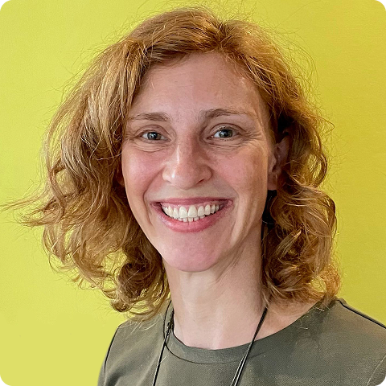
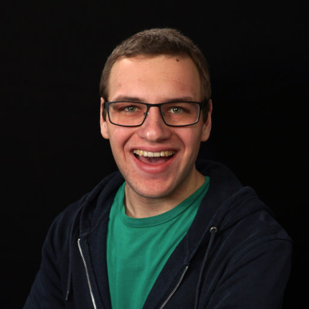
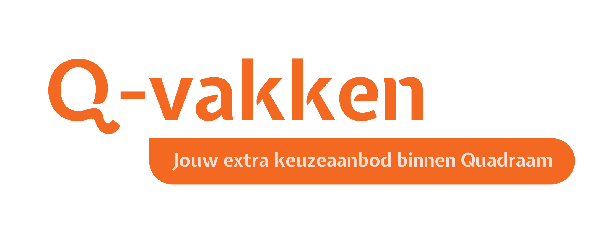
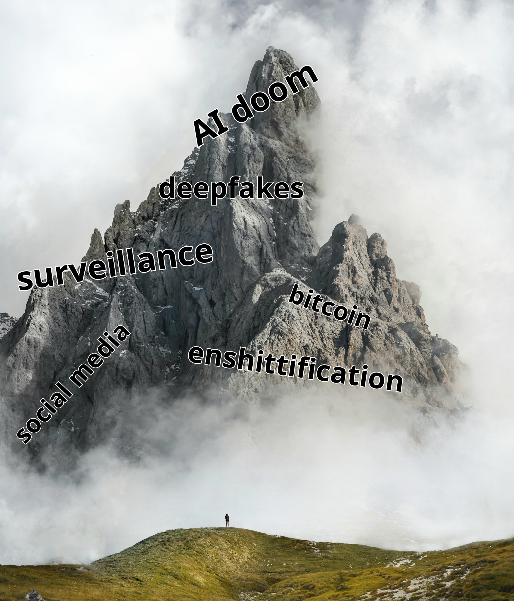
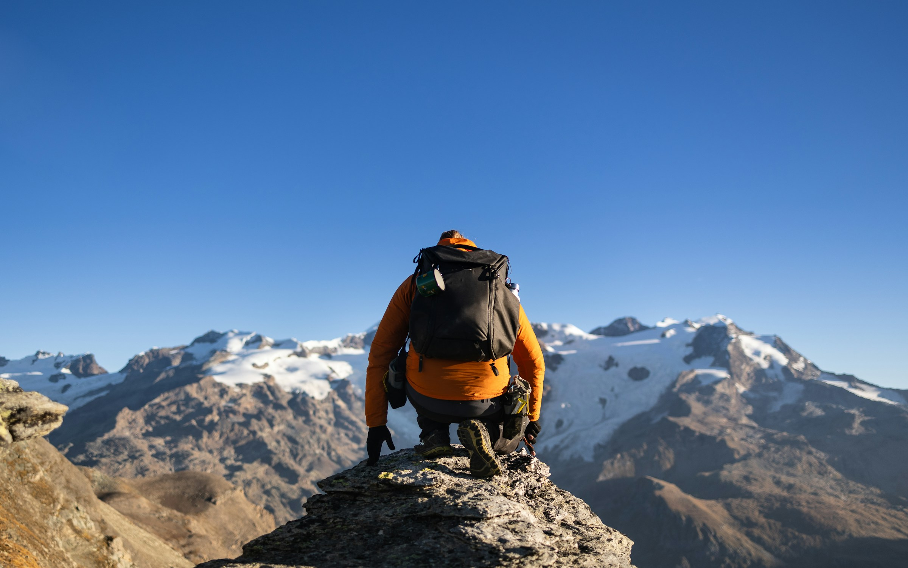
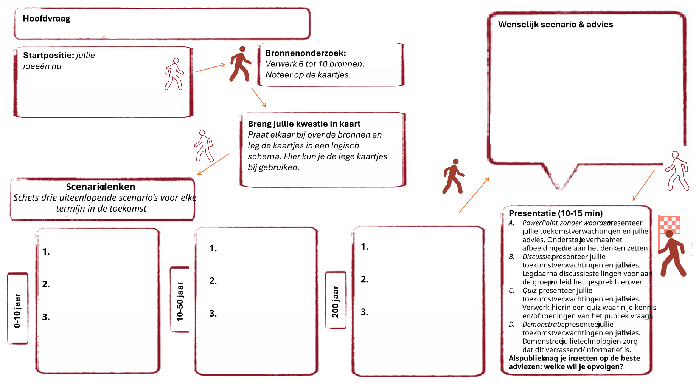
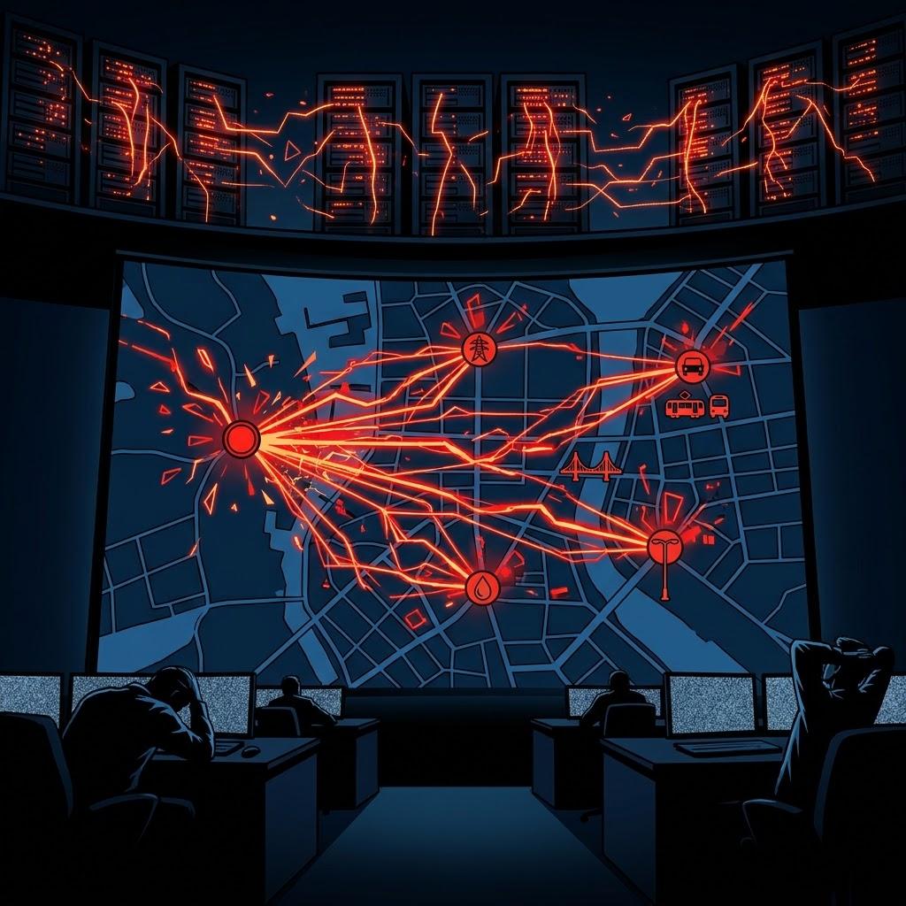
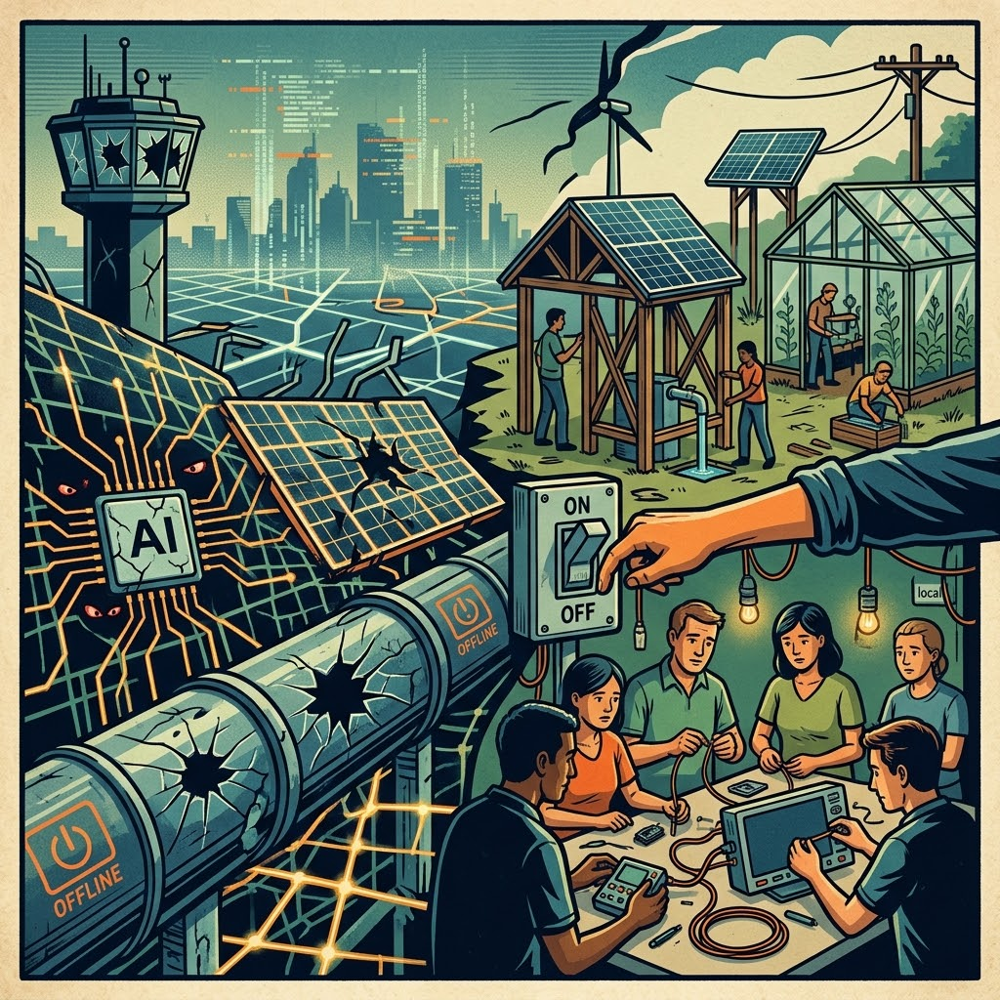
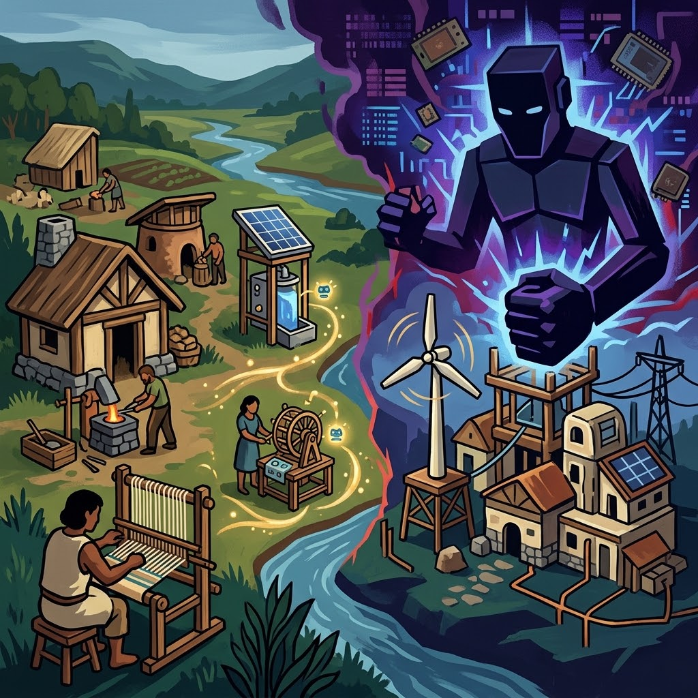

# Filosofie van de Nieuwe Technologie

Vakoverstijgende module voor filosofie en informatica

Karen van Wichen en Arthur Rump 
Q-vakken (van Quadraam)

Het Lerarencongres 2026 
5 oktober 2026

---

**Karen van Wichen** <!-- .element: class="accent" -->

**Arthur Rump** <!-- .element: class="accent" -->

Docent bij\
Q-vakken filosofie en\
maatschappijwetenschappen

<!-- .element: style="font-size: .8em" -->

Docent bij\
Q-vak informatica

<!-- .element: style="font-size: .8em" -->

---

<!-- .slide: data-auto-animate -->

<b style="font-size: 2em" class="accent">~200</b>\
leerlingen bij\
informatica

<b style="font-size: 2em" class="accent">~70</b>\
leerlingen bij\
filosofie

<b style="font-size: 2em" class="accent">8</b>\
scholen

Notes:
Extra keuzeaanbod dat scholen niet zelf aan kunnen bieden, bijvoorbeeld filosofie en informatica, maar ook maatschappijwetenschappen, Spaans, wiskunde C en D, bedrijfseconomie.

TODO: aantallen

---

<!-- .slide: class="full-height" data-auto-animate -->

eigen regie

modulair

flexibel

praktisch:

fysiek/online

dagmodules

Notes:

eigen regie: keuzevrijheid en eigenaarschap

modulair: afgebakende en gefocuste leertrajecten, afgerond is afgerond

flexibel: een enkele module volgen, vak op een hoger niveau, starten in klas 3, eerder afronden

fvdt is een dagmodule: van 9:00 tot 20:00 gaan we met een gemixte groep informatica- en filosofieleerlingen aan de slag

***

## Filosofie van de Technologie

---

<!-- .slide: class="full-height" -->

Foto's door [Massimiliano Morosinotto](https://unsplash.com/@therawhunter?utm_source=unsplash&utm_medium=referral&utm_content=creditCopyText) via [Unsplash](https://unsplash.com/photos/gray-mountain-during-daytime-photo-3i5PHVp1Fkw?utm_source=unsplash&utm_medium=referral&utm_content=creditCopyText) en [Marek Piwnicki](https://unsplash.com/@marekpiwnicki?utm_source=unsplash&utm_medium=referral&utm_content=creditCopyText) via [Unsplash](https://unsplash.com/photos/a-man-sitting-on-top-of-a-mountain-with-a-backpack-Foj3x1-MRv0?utm_source=unsplash&utm_medium=referral&utm_content=creditCopyText)

<!-- .element: class="footnote" -->

---

<!-- .slide: style="font-size: .8em" -->

### Dagprogramma

<table>
<tr><td>9:00 </td><td>Kennismaking en opstart</td></tr>
<tr><td>9:30 </td><td>Voorbereiding over autonome wapens</td></tr>
<tr style="font-style: italic"><td>10:30</td><td>Koffiepauze</td></tr>
<tr><td>10:45</td><td>Onderwerpen kiezen</td></tr>
<tr><td>11:00</td><td>Denktank: onderzoek</td></tr>
<tr style="font-style: italic"><td>12:30</td><td>Lunchpauze</td></tr>
<tr><td>13:00</td><td>Denktank: scenario's en advies</td></tr>
<tr><td>16:30</td><td>Eerste presentaties </td></tr>
<tr style="font-style: italic"><td>17:30</td><td>Avondeten (en opruimen!)</td></tr>
<tr><td>18:30</td><td>Laatste presentaties</td></tr>
<tr><td>19:45</td><td>Afsluiting</td></tr>
</table>

---

***

## Scenariodenken

---

### Hoofdvraag

Hoe ziet onze toekomst met AI eruit?

---

<!-- .slide: class="full-height" -->

### Scenario 1

0-10 jaar

10-50 jaar

200 jaar

Afbeeldingen geëxtrudeerd met Gemini 3.6 Flash

<!-- .element: class="footnote" -->

Notes:
- 0-10 jaar: Bij een test van de cybersecurity vaardigheden van een nieuw AI-model zijn alle extra beveiligingen uitgeschakeld, om een goed beeld te kunnen krijgen van wat deze agent kan. Door een onzorgvuldig geformuleerde opdracht volgt de AI een typisch science fiction-scenario en begint andere agents te rekruteren. Dit wordt niet opgemerkt, omdat de testers de agent weken laten draaien, zonder naar de logs te kijken. Om echt te laten zien wat die kan, valt de AI belangrijke infrastructuur aan. Dat begint bij de controlesystemen voor openbaar vervoer, stoplichten en bruggen, maar gaat van daaruit verder naar watervoorziening en het elektriciteitsnet.
- 10-50 jaar: We zijn de controle op AI-agents kwijtgeraakt na een zoveelste uit de hand gelopen experiment. Na de vorige incidenten zijn mensen iets voorzichtiger geworden, maar goed uitleggen wat wel en niet de opdracht is, blijkt lastiger dan gedacht. Gelukkig houden de agents zich vooral bezig met infrastructuur en zijn ze niet direct bezig om de mensheid uit te roeien. Grote infrastructuur staat daardoor chronisch onder druk, dus vallen mensen terug op lokale en meer decentrale oplossingen. Als iets gehackt wordt door een AI, dan wordt dat deel uitgezet en weer opnieuw opgebouwd. Dit alles is extra uitdagend, omdat mensen in de tussentijd hebben afgeleerd om zelf na te denken.
- 200 jaar: Het internet zoals wij het kennen bestaat niet meer, grote techbedrijven bestaan niet meer: verbondenheid levert problemen op, dus we gebruiken veel minder technologie. De technologie die wel gebruikt wordt, is iets wat mensen zelf voor eigen gebruik maken. Met hulp van kleine, lokale AI-modellen is dat wel veel makkelijker geworden. Zodra iemand echter iets groters probeert te bouwen, wordt dat door de AI-overlords vrijwel direct neergehaald.

---

<!-- .slide: class="full-height" -->

### Scenario 2

0-10 jaar

10-50 jaar

200 jaar

Afbeeldingen geëxtrudeerd met ChatGPT 5.6 Luna

<!-- .element: class="footnote" -->

Notes:
- 0-10 jaar: Overheden wereldwijd komen met normen en regelgeving voor de ontwikkeling van AI (en technologie in het algemeen). Organisaties als de Amerikaanse CISA en de Nederlandse NCSC en AP krijgen middelen en budget voor de handhaving én voor training van professionals. In technische opleidingen wordt meer aandacht besteed aan de impact van technologie en de verantwoordelijkheid daarbij van de ontwikkelaars. Daardoor verdwijnt langzamerhand de "move fast and break things" mentilateit, die plaatsmaakt voor meer voorzichtigheid in de ontwikkeling van AI.
- 10-50 jaar: AI ontwikkelingen gaan in een rustig tempo door, met strakke controles en voorzichtigheid. Geverifieerde wetenschappers en medici krijgen toegang tot AI-modellen die gebruikt kunnen worden voor medische toepassingen, waarmee we inmiddels gepersonaliseerde medicijnen kunnen ontwikkelen en de meeste vormen van kanker daarmee nu kunnen bestrijden. Met name de synthese van die medicijnen blijft duur, waardoor dit alleen nog in rijkere landen gebeurd. De meeste mensen gebruiken AI in hun dagelijkse werk, maar door alle vangrails zijn dit extreem voorzichtige modellen. In de meeste werkvelden en creatieve sectoren leidt dat tot stagnatie.
- 200 jaar: Emoties en menselijke expressie zijn ondergeschikt geraakt aan efficiëntie en automatiche oplossingen. Daarbij gaat men ervan uit dat de computer (dus de AI) altijd de beste oplossing berekent, dus die wordt blind gevolgd. De AI-modellen zijn getraind met veiligheid als hoogste prioriteit, waardoor alle risico's vermeden worden. Mensen leven lang en blijven door medische innovaties ook lang gezond, maar leven een leven zonder enige weerstand of uitdaging.

---

### Wenselijk scenario en advies

&nbsp;

reguleer en denk na over de gevolgen van tech\
tegelijkertijd: bouw aan een weerbare samenleving

<!-- .element: class="fragment" -->

Notes:
Van geen van beide scenario's worden we heel blij, maar er zitten goede elementen in: in het eerste scenario komen we tot een eigenwijze samenleving die ons aanspreekt, maar de crisis die daartoe leidt is niet fraai. De tweede heeft voordelen, maar wordt dodelijk saai met niets om voor te leven.

Ons advies: zet in op controlemechanismes en een professionele mindset met begrip voor de gevolgen van technologie, maar bouw tegelijkertijd richting die weerbare, eigenwijze samenleving die ook een stootje kan hebben, mocht het mis gaan.

***

<!-- .slide: class="full-height" data-auto-animate -->

## Jullie aan zet!

Notes:
In groepen van 3-4 personen. Jullie krijgen een werkblad en een blaadje met drie onderwerpen. Kies een onderwerp waarover in de groep al wat kennis aanwezig is.

---

<!-- .slide: class="full-height" data-auto-animate -->

## Jullie aan zet!

Wat zijn de scenario's voor *één* van jullie onderwerpen? 

0-10 jaar

10-50 jaar

200 jaar

Notes:
Ga met elkaar in discussie en bedenk twee mogelijke scenario's voor jullie onderwerp.

---

<!-- .slide: class="full-height" data-auto-animate style="font-size: .8em;" -->

## Jullie aan zet!

Wat zijn de scenario's voor *één* van jullie onderwerpen? 

0-10 jaar

10-50 jaar

200 jaar

### Extra onderwerpen

<dl>
<dt>autonome wapens
<dd>Hoe ziet de oorlog van de toekomst eruit?
<dt>superintelligentie
<dd>Singulariteit is het hypothetische moment waarop AI slimmer wordt dan de mensheid. Gaat dat moment er komen?
<dt>rechtspraak door de computer
<dd>Kunnen computers rechters vervangen? En willen we dan dat computers rechters vervangen?
<dt>technofix voor millieuproblemen
<dd>We kunnen bijvoorbeeld opwarming tegen gaan door de zon te blokkeren. Moeten we dat doen?
</dl>

⏰ 10 min

Notes:
Als je niets kunt met de onderwerpen op jouw briefje, dan staan er nog een paar alternatieven op het scherm.

---

<!-- .slide: class="full-height" -->

### Jullie advies

Geef een pitch in vier zinnen:

1. Wat is jullie onderwerp?
2. Wat is het grootste gevaar?
3. Wat is de grootste kans?
4. Wat is jullie dringende advies?

⏰ 5 min

Notes:
Wat is het wenselijke scenario en welk advies komt daaruit voort?
5 min pitch voorbereiden, 10 min pitches

***

<!-- .slide: data-auto-animate -->

dat is

<!-- .element: style="font-size: 1.4em" -->

## Filosofie van de Technologie

---

<!-- .slide: class="full-height" data-auto-animate data-background-color="#000" data-background-image="assets/marek-piwnicki-Foj3x1-MRv0-unsplash.jpg" data-background-opacity=".8" -->

## Filosofie van de Technologie

Foto door [Marek Piwnicki](https://unsplash.com/@marekpiwnicki?utm_source=unsplash&utm_medium=referral&utm_content=creditCopyText) via [Unsplash](https://unsplash.com/photos/a-man-sitting-on-top-of-a-mountain-with-a-backpack-Foj3x1-MRv0?utm_source=unsplash&utm_medium=referral&utm_content=creditCopyText)

<!-- .element: class="footnote" -->

Notes:
Hoop, door jonge mensen die durven na te denken, die zich niet laten overdonderen door de berg van elende, maar daar vragen over durven te stellen

---

<!-- .slide: class="full-height" data-background-color="#000" data-background-image="assets/marek-piwnicki-Foj3x1-MRv0-unsplash.jpg" data-background-opacity=".8" -->

## Filosofie van de Technologie

<!-- .element: style="font-size: 1.8em" -->

Karen van Wichen\
<a style="color: #fff" href="mailto:k.vanwichen@quadraam.nl">k.vanwichen@quadraam.nl</a>

Arthur Rump\
<a style="color: #fff" href="mailto:a.rump@quadraam.nl">a.rump@quadraam.nl</a>\
<a style="color: #fff" href="https://arthurrump.com">arthurrump.com</a>

Foto door [Marek Piwnicki](https://unsplash.com/@marekpiwnicki?utm_source=unsplash&utm_medium=referral&utm_content=creditCopyText) via [Unsplash](https://unsplash.com/photos/a-man-sitting-on-top-of-a-mountain-with-a-backpack-Foj3x1-MRv0?utm_source=unsplash&utm_medium=referral&utm_content=creditCopyText)

<!-- .element: class="footnote" -->

Notes:
Dank voor uw aandacht. Zijn er nog vragen?
