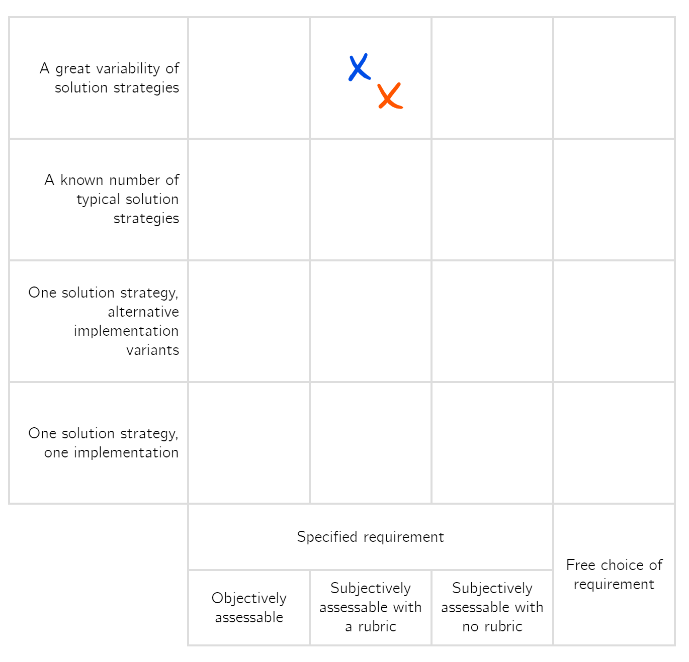

+++
title = "A Meta Perspective on a Refined Model of Ill-definedness"
tags = [ "Apollo", "Education" ]
date = 2022-11-03 09:46:02
blurb = "In a recent paper, we described a refined model of ill-definedness. Read that paper if you want to know what that means. In this post I describe how we can bootstrap that model, apply it to itself and determine how ill-defined the question of ill-definedness really is."

+++

Last week my co-author [Vadim Zaytsev](https://grammarware.net) presented our paper [A Refined Model of Ill-definedness in Project-Based Learning](/research/ill-definedness_edusymp2022) at the [Educators Symposium of MODELS 2022](https://conf.researchr.org/track/models-2022/models-2022-educators-symposium). Go read that paper first, or this won't make much sense. In this post I try to answer a question we got afterwards.

If you need some convincing to read the paper, or just want a short summary: the goal of the paper is to shed some light on what it means for an educational task to be ill-defined. For an ill-defined task there are many possible solutions; experts can disagree on which solution is better and there is no formal theory to determine or test outcomes; reaching the goal requires the design of new artefacts or analysis of new information; and the problem can not be subdivided into independent subproblems. We recognize that there is a spectrum of ill-definedness and extend an existing two-dimensional (verifiability and solution space) classification. We then consider the assessment criteria for two programming projects at the University of Twente and place them in the classification. See the image below for an example.

![A four by four grid filled with coloured bubbles. On the vertical axis, there are four categories. From the bottom up: one solution strategy, one implementation; one solution strategy, alternative implementation variants; a known number of typical strategies; and a great variability of solution strategies. On the horizontal axis, there are two primary categories: a specified requirement or a free choice requirement. For a specified requirement, there are three subcategories: objectively assessable, subjectively assessable with a rubric, and subjectively assessable with no rubric. Most criteria are concentrated in the upper left corner, spread along the edges for three cells. The colours represent four categories: correctness, scope, quality, and non-code.](assets/20221029-a-meta-perspective-on-a-refined-model-of-ill-definedness/criteria_ss.png "Our refined classification of assessment criteria in the programming project of Technical Computer Science's second module.")

After the presentation, [Peter Clarke](https://www.cis.fiu.edu/faculty-staff/clarke-peter-j/) asked an excellent question about bootstrapping this model: can the model be applied to itself? Let's try and see if it works.

## What does the model assess?

The model assesses the ill-definedness of an educational problem through its assessment criteria. So, just like a student's submission for a project is graded on how good it is according to certain criteria, we "grade" the project on how ill-defined it is according to certain criteria. To apply the model to itself, we only need to let go of one assumption, namely that a higher grade is better: we only make a call on how ill-defined a project is, regardless of whether an ill-defined project is good or bad. Now, the assessment of ill-definedness is just like the assessment of quality and we can use the model to determine how ill-defined our assessment of ill-definedness is.

To do so, we need to know the criteria on which we assess the ill-definedness of a project. In the model, both the original and our refined version, there are two criteria:

- The project has a large solution space.
- A solution is difficult to verify or assess.

If these are fulfilled, a problem is ill-defined. (Just like a solution or artefact is good, if it meets the assessment criteria.)

## How do these criteria fit in the model?

These criteria correspond the two axes used in the original model by [Le et al. (2013)](https://doi.org/10.1109/TLT.2013.16). If we place the criteria in the original model, both end up in class 5. Both criteria are clearly at the top of the classification: there are many ways in which a project can have a large solution space and solutions that are difficult to assess. Whether the solution space has "great variability of strategies" is not clearly verifiable, and neither is the line between verifiable and non-verifiable clear-cut. This means that both criteria are non-verifiable.

![A classification with four rows and two columns. The four rows are labelled, bottom up: one solution strategy, one implementation variant; one solution strategy, alternative implementation variants; a known number of typical solution strategies; and a great variability of solution strategies. The two columns are labelled: verifiable solutions, and non-verifiable solutions. In the left column, the four rows represent class 1 to 4, from bottom to top. In the right column, a single class (class 5) spans all four rows. Two marks are placed in class 5, at the top of the image.](assets/20221029-a-meta-perspective-on-a-refined-model-of-ill-definedness/image-20221029104708341.png "Criteria of the original model presented in the original model.")

We can also place the same criteria (as used in the original model) in our refined model. Both criteria are placed in the top row, just like in the original model. The criterion on large solution space is in the *subjectively assessable with a rubric* column: the model provides a rubric that describes four levels of a large solution space. The "difficult-to-assess" criterion is in the *subjectively assessable with no rubric* column: we have to pick between verifiable and non-verifiable in the original model, which is a (partly) subjective choice. Some may find a certain criterion easy to verify, while others would say it is not verifiable.

Then we can, of course, also place the criteria as used in the refined model in our refined model. Now the "difficult-to-assess" criterion has shifted one column to the left: instead of a subjective verifiable or non-verifiable question, our refined model provides a rubric to determine how difficult assessment for the criterion is. The rubric is part of a peer-reviewed publication, so we can even say that it is (at least somewhat) agreed upon.

## What does this tell us about the model?

The shift to the left shows that our model makes it easier to assess how difficult it is to assess a solution. This means that we have made the question of ill-definedness less ill-defined. I will leave it as an exercise to the reader to determine if this is a proof that our model works, merely a proof of internal consistency, or just a circular argument.

Even better than making ill-definedness less ill-defined, I believe that, according to our model, our model is the optimal solution. Trying to make a more objective description for both criteria does not make the model more useful as a tool, so we can't move the criteria further left. There also is no way to reduce the number of strategies to create an ill-defined problem in the real world, so we can't move the criteria down in the model. That proves that our model is the best possible model. 

Until someone decides to add another column, of course.

---

If you got the impression that I'm making fun of the question, you are only half right. I do find bootstrapping funny in general. Still, it is an important concept and certainly worth applying if you can. If it turned out that our refined model made the question of ill-definedness more ill-defined (according to our model), that would be a good reason to reconsider if we were really doing anything useful.
